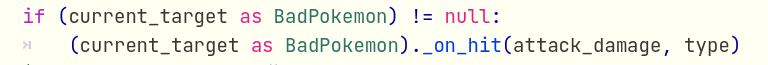
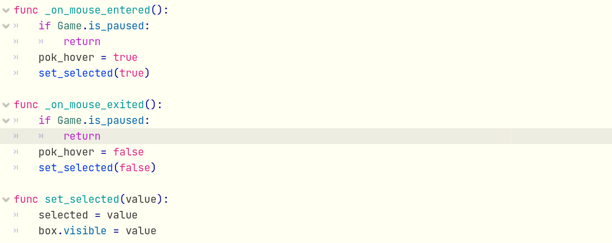
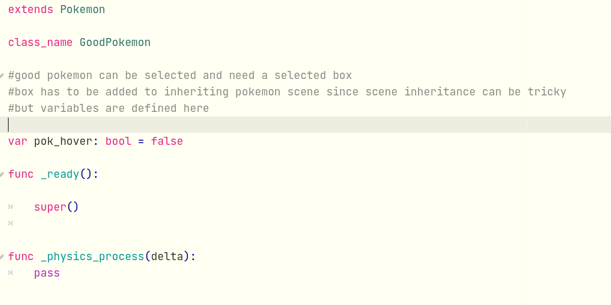
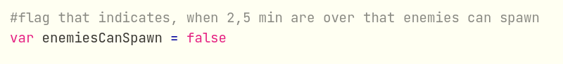
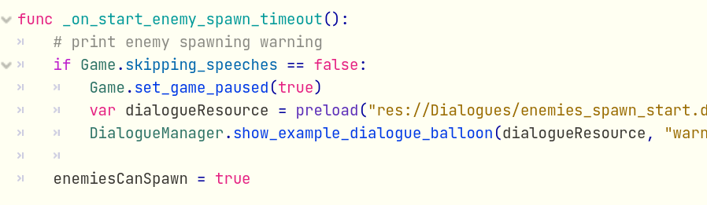
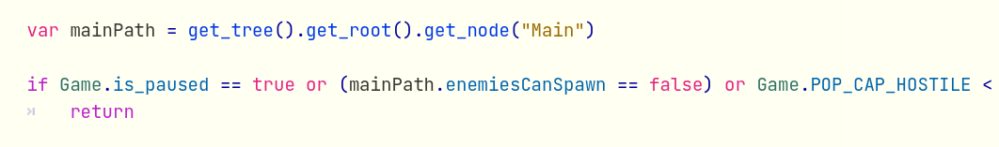
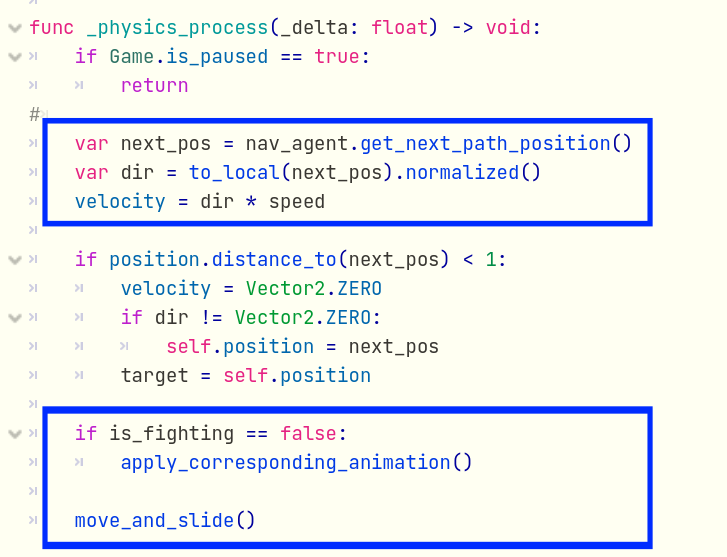
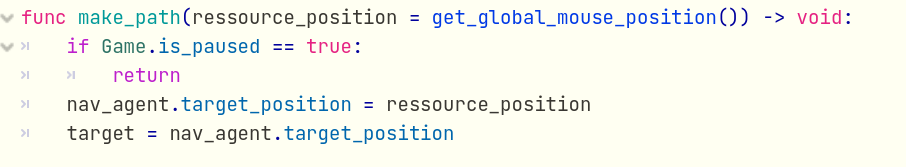

# Game Programming IMT 3603

# Individual Report - Max Neubauer (106077)

## Bad Code

For my bad code I chose the inheritance. In order to structure the code I wrote a Pokemon class. This class contains basic attributes that every pokemon has. E. G. speed, health or type and takes care of the animation.
The Pokemon class is extended by GoodPokemon and BadPokemon. BadPokemon is extended by the BigBadPokemon and the enemies. GoodPokemon is Extended by the military Pokemon and Pikachu.

This way it is possible to use these classes as Types to work with different Pokemon that belong to the same Type.

(This code is not from me)

Unortunately, there are still some functions left at the bottom of the inheritance (inside of Pikachu, Squirtle, Bulbasaur) that could be outsourced in GoodPokemon. This way redundant boilerplate code is avoided and the codebase becomes cleaner.

Due to the lack of outsourcing and abstraction the GoodPokemon class is currently almost empty. 

Another example of bad code is the use of global flag variables. Global flag variables may seem like a propper solution in the first place. But when the code becomes more and the number of flag variables increases, the complexity of the code increases sigificantly. 

Although I tried to use as few global flag variables as possible there are still some left. For example: I wanted to make sure that bad Pokemon only spawn after a certain amount of time. 

That is why I used a timer. When the time is over, then and only then bad Pokemon are allowed to spawn.

The abstract version of the code would look like this:
<pre>

// global flag
enemiesCanSpawn == false

// after the timer is finished
when_timer_is_finished() -> void:
enemiesCanSpawn == true

// in loop triggered by another timer
if enemiesCanSpawn == false:
    return
spawn_enemies()
</pre>

Here is initialise the flag.

Only to be set to true after some minutes.

And the flag is use inside of the BigBadPokemon class to prevent the Boss Pokemon from spawning smaller enemies at the first part of the game.

## Good Code

For the good code I want to present the navigation. Further information about the navigation on the TileMap can be found in the video. 

In order to use the navigation you need a CharacterBody2D and a NavigationAgent2D.

The abstract code of the navigation looks like this:

<pre>

// speed of the Character 
const speed = 100

// navigation agent
@onready var nav_agent:= $NavigationAgent2D as NavigationAgent2D

// here the actual algorithm of the navigation agent is used
func _physics_process(_delta: float) -> void:

    // the navigation agent returns the direction to arrive at the target
    var dir = to_local(nav_agent.get_next_path_position()).normalized()

    // the movement is calculated
    velocity = dir * speed

    // the player moves on the map
    move_and_slide()
	
// set the target_position to the designated area the character should walk to
func make_path(goal) -> void:
	nav_agent.target_position = goal
	
// when a certain condition is met, define the target and start moving
func _on_trigger():
    var goal = get_where_the_character_should_move()
    make_path(goal)
</pre>

A test of the navigation agent can be seen [here](https://github.com/TxRuX/Godot_Navigation).

The navigation code is short, straight to the point and easy to understand. That is why I consider it as good code. Secondly there are severel parts that are implemented in the Godot interface. Which makes is easier to use. The real A* algorithm is encapsulated and performace optimated.

And this is how the code is integrated:

## Reflextion

