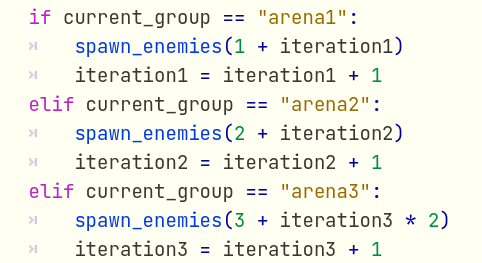
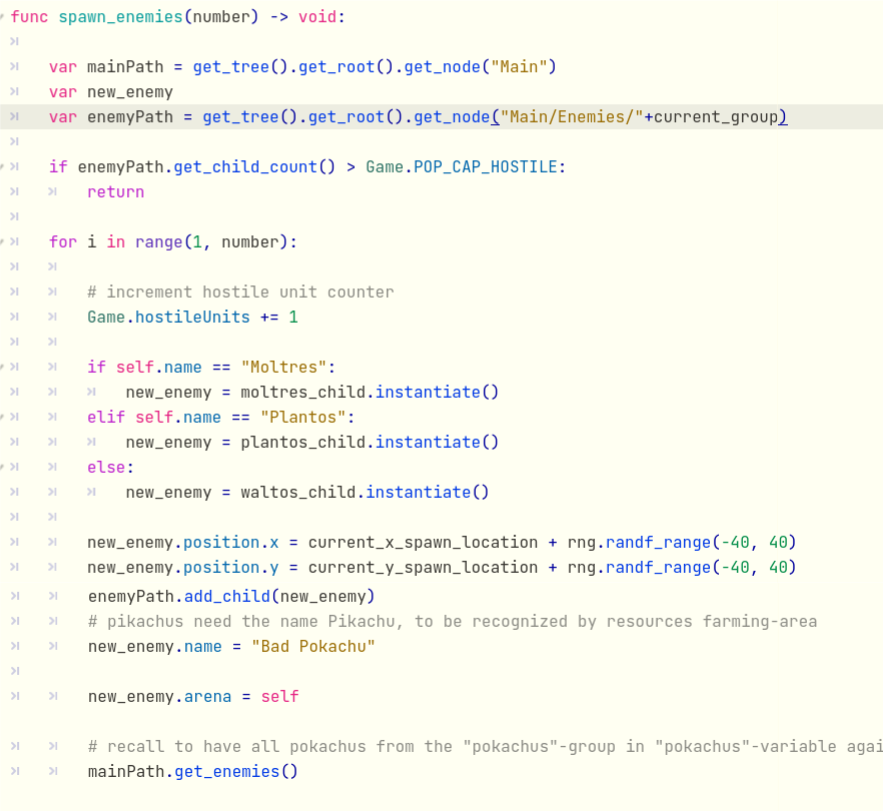

# Game Programming IMT 3603

# Individual Report - Max Neubauer (106077)

## Bad Code

For my bad code I chose the inheritance. In order to structure the code I wrote a Pokemon class. This class contains basic attributes that every pokemon has. E. G. speed, health or type and takes care of the animation.
The Pokemon class is extended by GoodPokemon and BadPokemon. BadPokemon is extended by the BigBadPokemon and the enemies. GoodPokemon is Extended by the military Pokemon and Pikachu.

This way it is possible to use these classes as Types to work with different Pokemon that belong to the same Type.

(This code is not from me, but shows how to use the inheritance (This is not bad code either))

Unortunately, there are still some functions left at the bottom of the inheritance (inside of Pikachu, Squirtle, Bulbasaur) that could be outsourced in GoodPokemon. This way redundant boilerplate code is avoided and the codebase becomes cleaner.

Due to the lack of outsourcing and abstraction the GoodPokemon class is currently almost empty. 

Another example of bad code is the use of global flag variables. Global flag variables may seem like a sufficient solution in the first place. But when the code becomes more and the number of flag variables increases, the complexity of the code also increases sigificantly. 

Although I tried to use as few global flag variables as possible there are still some left. For example: I wanted to make sure that bad Pokemon only spawn after a certain amount of time. 

That is why I used a timer. When the time is over, then and only then bad Pokemon are allowed to spawn.

The abstract version of the code would look like this:
<pre>

// global flag
enemiesCanSpawn == false

// after the timer is finished
when_timer_is_finished():
    enemiesCanSpawn == true

// in loop triggered by another timer
if enemiesCanSpawn == false:
    return
spawn_enemies()
</pre>

Here is the initialisation of the flag.

Only to be set to true after some minutes.

And the flag is only used inside of the BigBadPokemon class to prevent the Boss Pokemon from spawning smaller enemies at the first part of the game.

## Good Code

For the good code I want to present the navigation. Further information about the navigation on the TileMap can be found in the video. 

In order to use the navigation you need a CharacterBody2D and a NavigationAgent2D.

The abstract code of the navigation looks like this:

<pre>

// speed of the Character 
const speed = 100

// navigation agent
@onready var nav_agent:= $NavigationAgent2D

// here the actual algorithm of the navigation agent is used
func _physics_process(_delta: float):

    // the navigation agent returns the direction to arrive at the target
    dir = to_local(nav_agent.get_next_path_position()).normalized()

    // the movement is calculated
    velocity = dir * speed

    // the player moves on the map
    move_and_slide()
	
// set the target_position to the designated area the character should walk to
func make_path(tartget_position):
    nav_agent.target_position = targer_position
	
// when a certain condition is met, define the target and start moving
func _on_trigger():
    target_position = get_where_the_character_should_move()
    make_path(target_position)
</pre>

A test of the navigation agent can be seen [here](https://github.com/TxRuX/Godot_Navigation).

The navigation code is short, straight to the point and easy to understand. That is why I consider it as good code. Secondly there are severel parts that are implemented in the Godot interface. Which makes is easier to use. The real A* algorithm is encapsulated and performace optimated by Godot.

And this is how the code is integrated:

Another good code example is the mechsnism of spawning enemy Pokemon.
To make the game more difficult the more time runs by we decided, that the amount of enemies which are spawning should incrase with every attack wave. Furthermore, the amount of spawing enemies differes between the 3 BigBadPokemon. To realise this design decision there is an *iteration* variable for each BigBadPokemon that increases by 1 with every wave.
Depending on which BigBadPokemon is to spawn enemies there is a conditional clause that executes the spawn enemy function which takes the number of enemies to spawn.

Inside of the *spawn_enemy* function I iterate from 1 to the given number and spawn the accompanying Pokemon every time. To make the spawning look better, the Pokemon do not spawn at the same position. The random number generator determines the exact position with their random number between -40 and 40. This way it looks as if the enemies spawn in a circle around the BigBadPokemon (The curcular form comes from the collision shape around the BigBadPokemon).

I consider this code as good because it is well structured and readable. It also separates the enemy spawning logic into a function which makes the first part more readable and changes can be applied easier.

## Video

In this video i am going to present how the navigation works on the TileMap and how timers are used to trigger certain actions.

These are only some implementations made in the Godot interface. But since the other team members will also present some settings directly connected to the interface there will be a great overview.

## Reflextion

Was the course worth taking? Yes, definitally. 

Before this semester I had never touched Game programming or a Game Engine. I was familiar with backend serverside programming and hardware programming but I had no idea how to struckture Games or what the development process would be like.

Now I am not that angry anymore when I face game lags because I understand the struggle in the background :)

Moreover, I understand that a game consists of lots of different facets which need to harmonize in order to get a good game experience. There is the music, the animation, the interface, the logic and the structure of all the different components like the Pokemon in our game.
The structure of the project and the structure of the data is different from typical structures in backend serverside programming. When I started the project I had no idea of how to work and interact with all the different scenes. But the deeper i dived into the matter and the more I used them the more familiar I became with the structuring and intercations. Every Scene has instances underneath it. E. G. a player has a health bar, a collision shape (to interact with the environment) and a sprite (or animated sprite) to appear as a player and get basic functionality. The player is in a scene interacting with other players. The main scene also has a music player and a user interface (which consists of other scenes). 

Another very imortant point to make is that the Game Engine already handles a lot of difficult algorithems and settings. Getting familiar with using the Engine effectively is another skill that helps reducing code and developing the game faster.

Since my development progress was not optimal I learned about the issues that take time when you do not take tham serously. When I develop my next game I will invest a lot more time into the engineering and planing part. Because a well structured development plan reduces stress, time and enables easy scalebility. Another thing I will do better is reduce finding workarounds. If there is no support to a certain issue, then your way of implementation is not the inteded way. There will probaply be an easier option with lots of support. (Of course there are exceptions). 

Putting everything into one account, I come to the conclusion that I learned a lot about game development and programming. Because I started with zero knowledge and now I understand the development progress of creating and coding a computer game.

